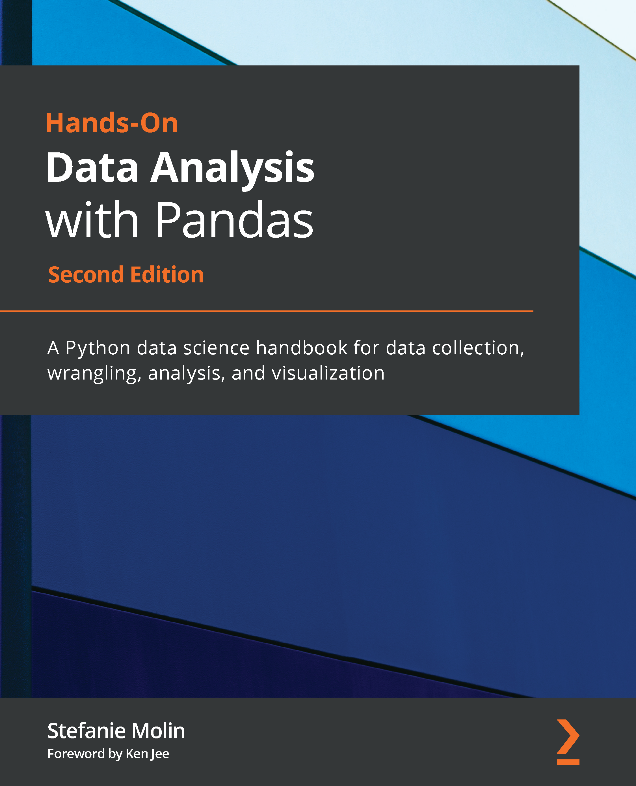

# Hands-On Data Analysis with Pandas – Segunda Edição

Este é o repositório de código do meu livro [Hands-On Data Analysis with Pandas](https://www.amazon.com.br/Hands-Data-Analysis-Pandas-visualization/dp/1800563450), publicado pela Packt em 26 de julho de 2019 ([1ª edição](https://www.amazon.com.br/Hands-Data-Analysis-Pandas-visualization/dp/1789615321)) e 29 de abril de 2021 ([2ª edição](https://www.amazon.com.br/Hands-Data-Analysis-Pandas-visualization/dp/1800563450)).

## Descrição do Livro
A análise de dados se tornou uma habilidade essencial em uma variedade de domínios onde saber como trabalhar com dados e extrair insights pode gerar um valor significativo. *Hands-On Data Analysis with Pandas* irá mostrar como analisar seus dados, começar com aprendizado de máquina e trabalhar de maneira eficaz com as bibliotecas Python frequentemente usadas em ciência de dados, como pandas, NumPy, matplotlib, seaborn e scikit-learn.

Usando conjuntos de dados do mundo real, você aprenderá a usar a biblioteca pandas para realizar manipulação de dados para remodelar, limpar e agregar seus dados. Em seguida, você aprenderá como conduzir análise exploratória de dados calculando estatísticas resumidas e visualizando os dados para encontrar padrões. Nos capítulos finais, você explorará algumas aplicações de detecção de anomalias, regressão, agrupamento e classificação usando scikit-learn para fazer previsões com base em dados passados.

Esta edição atualizada irá equipá-lo com as habilidades necessárias para usar o pandas 1.x para realizar eficientemente várias tarefas de manipulação de dados, reproduzir análises de forma confiável e visualizar seus dados para tomada de decisão eficaz — conhecimentos valiosos que podem ser aplicados em vários domínios.

## O Que Você Irá Aprender
*Pré-requisito: Se você não possui conhecimento básico de Python ou experiência prévia com outra linguagem (R, SAS, MATLAB, etc.), consulte o Jupyter Notebook [`ch_01/python_101.ipynb`](./ch_01/python_101.ipynb) para um curso/introdução rápida de Python.*

- Entender como os analistas e cientistas de dados coletam e analisam dados
- Realizar análise e manipulação de dados em Python
- Combinar, agrupar e agregar dados de várias fontes
- Criar visualizações de dados com `pandas`, `matplotlib` e `seaborn`
- Usar bibliotecas de ciência de dados Python para analisar conjuntos de dados do mundo real
- Usar o `pandas` para resolver vários problemas comuns de representação e análise de dados
- Coletar dados de APIs
- Construir scripts, módulos e pacotes Python para código de análise reutilizável
- Utilizar conceitos e algoritmos de ciência da computação para escrever código mais eficiente para análise de dados

## Sumário
- [Capítulo 1, *Introdução à Análise de Dados*](./ch_01), irá ensinar os fundamentos da análise de dados, fornecer uma base em estatísticas e configurar seu ambiente para trabalhar com dados em Python usando Jupyter Notebooks.

- [Capítulo 2, *Trabalhando com DataFrames Pandas*](./ch_02), apresenta a biblioteca `pandas` e mostra os conceitos básicos de trabalho com `DataFrames`.

- [Capítulo 3, *Manipulação de Dados com Pandas*](./ch_03), discute o processo de manipulação de dados, mostra como explorar uma API para coletar dados e guia você através da limpeza e remodelação de dados com pandas.

- [Capítulo 4, *Agregação de DataFrames Pandas*](./ch_04), ensina como consultar e mesclar DataFrames, realizar operações complexas, incluindo cálculos e agregações rolantes, e como trabalhar efetivamente com dados de séries temporais.

- [Capítulo 5, *Visualizando Dados com Pandas e Matplotlib*](./ch_05), mostra como criar suas próprias visualizações de dados em Python, primeiro usando a biblioteca `matplotlib` e depois diretamente a partir de objetos `pandas`.

- [Capítulo 6, *Visualizando com Seaborn e Técnicas de Customização*](./ch_06), continua a discussão sobre visualização de dados ensinando como usar a biblioteca `seaborn` para visualizar seus dados em formato longo e fornecendo as ferramentas necessárias para customizar suas visualizações, tornando-as prontas para apresentação.